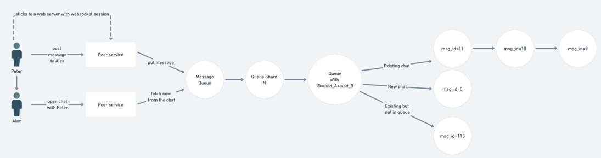
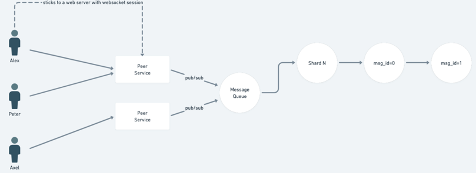
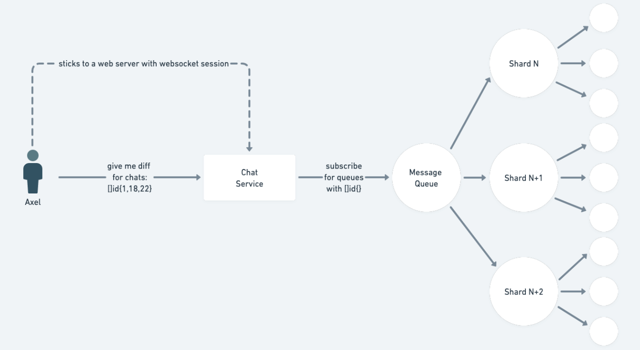

# Design document for messanger driver

## The main idea
This doc is intended to make the process of development easier.
Below are provided the common assumptions for chat engine design.

## Technologies

Tarantool is chosen as a basic technology for implementing this driver, due to its 
ability to be an app server and in memory persistent db at the same time.

## General Assumptions
1. All the messages are living in one table (physically space object(-s) for tnt) that can be sharded.
2. Over this table we implement a logic that provides a functionality of a customized queue.
3. For each connected client (that must be a service which holds thousands of websocket connections with
other clients) we keep just one connect and provide some multiplexing.
4. If the client get a new websocket (WS) connection we must provide a mechanism to add this new connected 
peer in polling of chats.
5. If a client closes a WS connection we must provide a mechanism to delete it from polling of chats.

## Some details 
### How is the queue "customized"?
Let's consider the next scheme for peer-to-peer chat.

Let's consider the next scheme for peers-to-peers chat.

